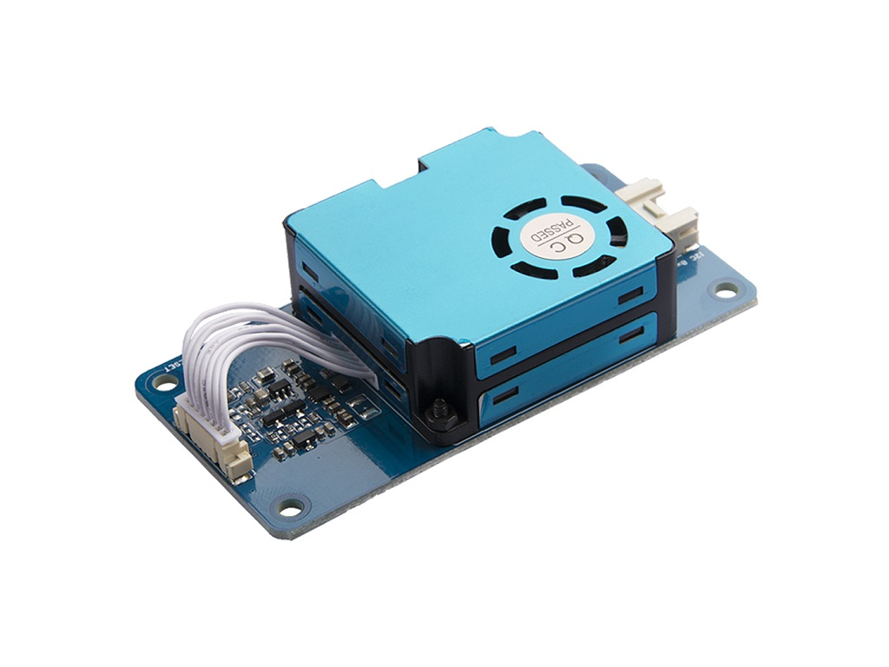
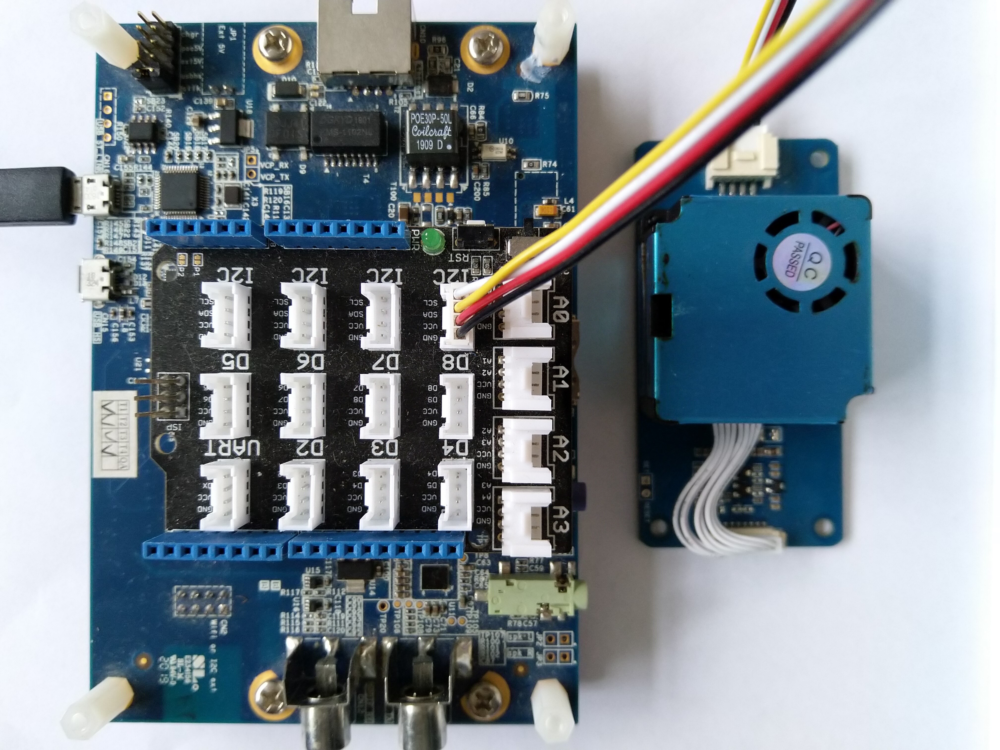
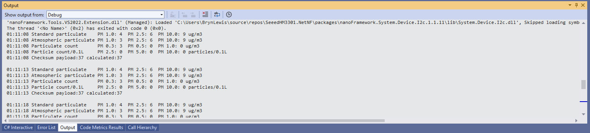

# SeeedstudioHM3301.NetNF
A C# library for [Seeedstudio Grove-Laser PM2.5 Dust Sensor HM3301](https://www.seeedstudio.com/Grove-Laser-PM2-5-Sensor-HM3301.html) sensor connected to a [.NET nanoFramework](https://www.nanoframework.net/) powered device.

This repository has the source code for the series of blog posts written as I worked on the library

01. [HM3301 Basic connectivity](http://blog.devmobile.co.nz/2023/03/28/net-nanoframework-seeedstudio-hm3301-basic-connectivity/)
02. [HM3301 library on Github](net-nanoframework-seeedstudio-hm3301-library-on-github)

<b>NB This library is a work in progress and should be considered late beta</b>

After soak testing I will "refactor" the library so it can be included in the [.NET nanoFramework IoT.Device](https://github.com/nanoframework/nanoFramework.IoT.Device) repository.
